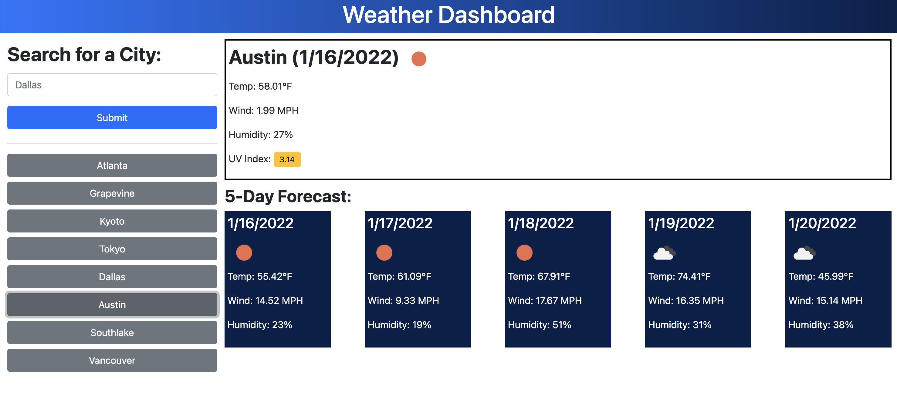

# Weather Dashboard

Developer: Sydney Mercier

For: UT Austin Coding Bootcamp

Deployed: https://sygmo.github.io/weather-dashboard/

## Overview

This weather dashboard displays today's weather for a city chosen by the user, as well as a 5-day forecast. The most recent search history is also saved and presented as buttons that can be clicked to display weather for that location again. The UV index will change colors based on the severity of the current value. 

## Development

The app was built with HTML, CSS, and pure JavaScript, with the only framework used being Bootstrap to shape the appearance. The weather data is pulled from two APIs provided by [OpenWeather](https://openweathermap.org/api). Initially I only planned to use their Current Weather Data API, but it doesn't return UV index or future forecast data so I had to use their One Call API instead. The Current Weather Data API was still useful for getting latitude and longitude values from a city name, which were then queried to the One Call API to fetch the weather data.

For future development I would like to make the app more responsive. Right now it looks very messy when the screen size is reduced.